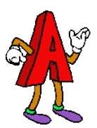

# Astar 
A* algorithm implementation/playground (:

### Why
This was one of the algorithms that I never really fully understood when I came across it in college, 
so I decided to implement it now.

### Overengineered
I tried to separate the logic of the algorithm itself from the stuff that was there to help with
the visualization. It ended up a bit more confusing than what I expected, but it works ok.
```(Node, Grid, AstarAlgorithm) -> A* stuff```
```(Cell, GameGrid, AstarVisualization) -> Visualization/Drawing stuff```

### What can it do?
The user can set (and unset with right click) the start, end and obstacle nodes. *(mouse r and l buttons)*

It is also possible to switch among some heuristics methods *(manhattan, chebyshev, euclidean) ("h")*

We can allow and disallow diagonals as well *("d")*

### Demo


the final path is slowed down on purpose

### Based on
Used these as examples:
- https://www.youtube.com/watch?v=JtiK0DOeI4A
- https://en.wikipedia.org/wiki/A*_search_algorithm